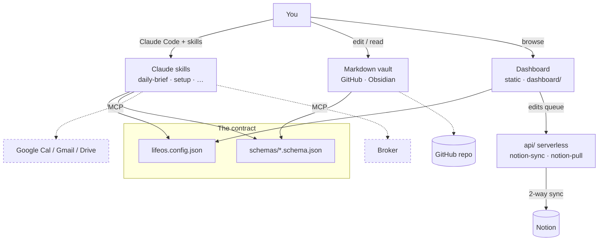

<h1 align="center">🧭 LifeOS</h1>

<p align="center">
  <strong>An AI-native personal operating system.</strong><br>
  A plain-text life vault + a warm, config-driven dashboard + Claude skills + Notion/Google/broker connectors.
</p>

<p align="center">
  <a href="#-quickstart">Quickstart</a> ·
  <a href="#-architecture">Architecture</a> ·
  <a href="#-onboarding--bring-your-own-data">Onboarding</a> ·
  <a href="#-connectors">Connectors</a> ·
  <a href="#-philosophy">Philosophy</a> ·
  <a href="docs/ROADMAP.md">Roadmap</a>
</p>

<p align="center">
  <a href="https://vercel.com/new/clone?repository-url=https://github.com/OWNER/lifeos&output-directory=dashboard">
    
  </a>
  &nbsp;·&nbsp; <a href="LICENSE"></a>
  &nbsp;·&nbsp; <em>Live demo: <code>lifeos.vercel.app</code> (deploy the demo persona — no setup required)</em>
</p>

> Replace `OWNER` in the Deploy button and demo link with your GitHub handle after you publish.

---

## What is LifeOS?

LifeOS turns "I should get organized" into **evidence, not ideas**. It is a small, private-by-default system you *own*: your data lives in your own Git repo, your browser, and (optionally) your own Notion and Vercel — there is no LifeOS server.

The trick that makes it generic: **the framework contains no content, only paths and a contract.** One `lifeos.config.json` personalizes everything; JSON Schemas in `schemas/` describe every data file so *any* AI can read your notes and fill the system in for you. Swap one `mission.json` and the entire dashboard hero re-renders around your current focus.

It ships with a complete demo persona ("Alex Rivera") so a fresh clone renders fully with **zero setup**.

## ✨ Features

| | |
|---|---|
| 🎯 **One hero mission at a time** | The dashboard centers a single focus with a live countdown, "the one thing right now," a weekly arc, and an evidence checklist — all from `dashboard/mission.json`. |
| ✅ **Tasks & habits, live** | Natural-language task composer (`#area P1 due:tomorrow`), a weekly habit matrix with streak history, saved locally and optionally 2-way synced to Notion. |
| 📚 **Knowledge base** | A searchable "about you" — the raw material an AI uses to write your briefs. Schema-defined so it's easy to import. |
| ⚓ **The Anchor (Inner OS)** | A calm break-glass surface: grounding protocols, a philosophy of "enough," and a 7-day reset. The psychology-aware differentiator. |
| 💰 **Finance** | Net worth, monthly budget, and an optional broker portfolio view. Currency-configurable. |
| 🌙 **4-step daily review** | Two gentle minutes: how the day felt, presence with the people you love, three small thanks, tomorrow's one thing. |
| 🤖 **Claude skills** | `daily-brief`, `quick-capture`, `weekly-review`, `setup`, `mission-swap` — the AI-native workflow layer. |
| 🎨 **Warm, theme-aware UI** | The "Hearth" design language (paper, terracotta, gold) in light and dark, a mobile dock, and reduced-motion support. |
| 🔒 **Private by default** | Secrets in env vars only; your vault content is gitignored; the framework ships templates + a demo, never a life. |

## 🚀 Quickstart

```bash
git clone https://github.com/OWNER/lifeos.git
cd lifeos

# 1. (optional) make it yours — the example is the fallback, so you can skip this to see the demo
cp lifeos.config.example.json lifeos.config.json

# 2. open the dashboard — no build step
open dashboard/index.html          # or: python3 -m http.server 8000
```

Then, in Claude Code, run **`/setup`** to be interviewed and have your config + first vault written for you. Or run **`/daily-brief`** to see the workflow.

Deploy the dashboard to the web with the **Deploy with Vercel** button above (it serves `dashboard/`). It works with **no environment variables** — Notion sync simply degrades to local-only.

## 🏗️ Architecture



`lifeos.config.json` + `schemas/` are the seam everything reads. The dashboard is static; the only backend is a pair of serverless functions *you* deploy for Notion sync. Everything else is optional and connects over MCP. Full write-up: **[docs/ARCHITECTURE.md](docs/ARCHITECTURE.md)**.

## 🧭 Onboarding — bring your own data

Ingestion is **prompt-driven against the schemas**, so you can use whatever AI you like.

| Path | What happens | Effort |
|---|---|---|
| **`/setup` skill** (flagship) | Claude interviews you → writes `lifeos.config.json` → "paste anything about your life" → maps it onto the schemas + templates → generates your first daily brief. | ~10 min |
| **Plain-text import** | Copy a mega-prompt that embeds the schemas into any AI, paste your notes, get back valid data files. | ~10 min |
| **Notion import** | Duplicate the Notion template → set 3 env vars → `notion-pull` hydrates the dashboard. | ~10 min |
| **MCP setup** | Claude reads your existing Notion / Calendar over MCP and bootstraps the vault. Most magical. | ~20 min |

Details: **[docs/onboarding.md](docs/onboarding.md)**.

## 🔌 Connectors

| Connector | v1 scope | Class |
|---|---|---|
| **Vercel** | Deploy button + `vercel.json` | One-click |
| **Notion** | 2-way Tasks/Habits sync + a public template with the exact property names the code expects | Guided ~10 min |
| **Google** (Cal/Gmail/Drive) | MCP-based, docs-only in v1 (serverless functions are on the roadmap) | Guided via MCP |
| **GitHub** | `repo.url` in config + "your vault is a repo" docs | One-click |
| **Broker** | MCP-based (a broker's public MCP endpoint); the finance card also works with manual JSON | Guided via MCP |
| **Anything else** | The [connector contract](docs/connectors/README.md) — env vars + a data JSON + an optional `api/` function | Contributions welcome |

## 🪷 Philosophy

LifeOS is opinionated in one direction: **from *Think → Plan → Improve the plan → Think again* to *Think once → Build → Measure → Improve.*** Two ideas do most of the work:

- **One hero mission at a time.** Everything else is *parked, not abandoned*. Running every front at full intensity ends in freeze; sequencing is the cure.
- **Evidence, not ideas.** Every week should end with an artifact you can point at. The dashboard makes the artifact the win.

It's built to support people who over-plan under pressure — who generate more meaning than they have containers for. The Anchor (Inner OS) is where that psychology gets a calm home instead of a 1 AM spiral.

## 🗺️ Roadmap

Built now: config-driven dashboard, Notion 2-way sync, the skill layer, the demo persona. Planned: serverless Google Calendar/Gmail functions, a capture pipeline, deeper broker integration. See **[docs/ROADMAP.md](docs/ROADMAP.md)**.

## 🤝 Contributing

Small and focused, private-by-default. See **[CONTRIBUTING.md](CONTRIBUTING.md)** and **[CODE_OF_CONDUCT.md](CODE_OF_CONDUCT.md)**. Never commit personal data — CI runs a generic PII/secret scan on every PR.

## 📄 License

[MIT](LICENSE). Copying is the success condition here, not the threat — build your own life on it.
