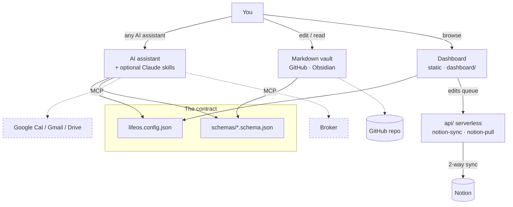

<h1 align="center">LifeOS</h1>

<p align="center">
  A plain-text vault for your life plus a dashboard that renders it — driven by whatever AI assistant you already use.
</p>

<p align="center">
  <a href="https://vercel.com/new/clone?repository-url=https://github.com/siddath/lifeOS&output-directory=dashboard">
    
  </a>
  &nbsp;·&nbsp; <a href="LICENSE"></a>
</p>

> The deploy button points at this repo. If you fork LifeOS, change `siddath/lifeOS` to your own handle so it deploys your copy.

<!-- Screenshot: capture dashboard/index.html running the demo persona and drop it in as docs/assets/hero-desktop-light.png. Capture list: docs/assets/README.md -->
<p align="center"><em>Screenshot goes here — see <a href="docs/assets/README.md">docs/assets/README.md</a> for the capture list.</em></p>

---

## What this is

Most "get organized" systems fail the same way: you spend an afternoon setting them up and never look at them again. LifeOS is built the other way around. Your life lives as plain Markdown and JSON in a Git repo you own; a static dashboard renders it; and an AI assistant does the tedious part — reading your messy notes and turning them into the structured files the dashboard reads.

There's no LifeOS server and no account. Your data sits in your repo, your browser's local storage, and — if you opt in — your own Notion and Vercel. Nothing phones home.

The one design decision everything hangs off: **the framework ships no content, only paths and a contract.** A single `lifeos.config.json` holds who you are; JSON Schemas in `schemas/` describe every data file. Swap one `mission.json` and the whole dashboard re-renders around your current focus. Because the shapes are written down, any AI can read your notes and fill the system in — you don't need this specific tool or that specific model.

A fresh clone runs immediately as a demo persona ("Alex Rivera," a product engineer in Portland) so you can see the whole thing working before you touch a file.

## Works with any AI

This isn't tied to one assistant. The instructions an AI needs live in [`AGENTS.md`](AGENTS.md) — a plain file that Claude, ChatGPT, Cursor, Copilot, Gemini, or anything else can read. Point your assistant at it and say "help me set this up." It recognizes the demo data as placeholder, asks for yours (or reads what you hand it — a paragraph, an Obsidian vault, a Notion export, a folder of notes), and maps it onto the schemas.

There's also a set of Claude Code skills (`/setup`, `/daily-brief`, `/weekly-review`, and friends) bundled under `.claude/` for people who use Claude Code — a convenience layer, not a requirement. The schemas are what make it portable; the skills are one nice way to drive them.

## What's in it

- **One hero mission at a time.** The dashboard centers a single focus with a live countdown, "the one thing right now," a week-by-week arc, and an evidence checklist. All of it renders from `dashboard/mission.json`; swap the file to swap the mission (about a ten-minute edit).
- **Tasks and habits, live.** A natural-language task box (`#area P1 due:tomorrow`), a weekly habit grid with streak history, saved in your browser and optionally two-way-synced to Notion so your phone and desktop agree.
- **A knowledge base about you.** Searchable notes — strengths, watch-outs, preferences, one entry per life area. This is the raw material an AI reads to write your daily brief.
- **The Anchor.** A calm break-glass page: grounding steps, a few reframes, a seven-day reset. It's the part that assumes you're a person who spirals under pressure, not a productivity robot.
- **Finance.** Net worth, a monthly budget, and an optional broker view. Currency comes from your config.
- **A four-step evening review.** Two minutes: how the day felt, presence with the people you love, three small thanks, tomorrow's one thing.
- **A warm, theme-aware UI.** Light and dark, a mobile dock, reduced-motion support. Opinionated about being calm rather than loud.

## Quickstart

```bash
git clone https://github.com/siddath/lifeOS.git
cd lifeOS

# Optional — make it yours. Skip it and you'll see the demo persona.
# This file is safe to commit (identity + toggles, no secrets); committing it
# is exactly what makes a deploy render as you instead of the demo.
cp dashboard/lifeos.config.example.json dashboard/lifeos.config.json

# Serve the dashboard — recommended, because file:// blocks the JSON fetches it needs
# (config, mission, tasks/habits seeds). No build step.
python3 -m http.server 8000      # then open http://localhost:8000/dashboard/

# Zero-server fallback (works, but some data may not load under file://):
open dashboard/index.html
```

Then open your AI assistant in this folder and tell it to read `AGENTS.md` and help you get started. It'll ask about you (or take whatever notes you already have), write your `lifeos.config.json`, and fill in your first mission, tasks, and knowledge base. If you use Claude Code, `/setup` does the same thing as a guided interview.

When you want it on your phone, deploy the `dashboard/` folder with the button up top. It runs fine with zero environment variables — Notion sync just stays dormant until you add keys. Full deploy notes: [docs/deploy.md](docs/deploy.md).

## Architecture



`lifeos.config.json` and `schemas/` are the seam everything reads. The dashboard is static. The only backend is a pair of serverless functions *you* deploy for Notion sync — everything else is optional and connects over MCP. Longer write-up: [docs/ARCHITECTURE.md](docs/ARCHITECTURE.md).

## Bring your own data

Import is prompt-driven against the schemas, not a rigid importer — so it works with whatever AI you like and whatever shape your notes are in. Four ways in:

| Path | What happens | Effort |
|---|---|---|
| **Just talk to your AI** | Point it at `AGENTS.md`, answer a few questions, and it writes your config, mission, tasks, and knowledge base against the schemas. | ~10 min |
| **Paste your notes** | Hand it a brain-dump, an old journal, a task list — messy is fine. It maps them onto the schemas and hands back valid data files. | ~10 min |
| **Notion** | Build two small Notion databases from the property tables in the guide, set four env vars, pull — the dashboard hydrates from your Notion databases and syncs both ways. | ~10 min |
| **Existing tools over MCP** | Let the AI read your calendar and notes over MCP and bootstrap the vault from what's already there. | ~20 min |

Details, including the demo persona and how the AI recognizes it as placeholder: [docs/onboarding.md](docs/onboarding.md). The placeholder convention itself is in [DEMO_DATA.md](DEMO_DATA.md).

## Connectors

| Connector | What v1 gives you | Setup |
|---|---|---|
| **Vercel** | Deploy button + `vercel.json` | One click |
| **Notion** | Two-way Tasks/Habits sync; build two DBs by hand from the exact property tables in the guide | ~10 min, [guide](docs/connectors/notion.md) |
| **Google** (Cal/Gmail/Drive) | Read access over MCP today; serverless sync is on the roadmap | Via MCP |
| **GitHub** | `repo.url` in config wires the vault-is-a-repo links | One line |
| **Broker** | Any broker's public MCP endpoint; the finance card also takes manual JSON | Via MCP |
| **Something else** | The [connector contract](docs/connectors/README.md): an env var, a data JSON, and an optional `api/` function | — |

## Why it's shaped this way

LifeOS is opinionated in exactly one direction: it wants to move you from *think → plan → improve the plan → think again* to **think once, then build, measure, improve.** Two ideas carry most of the weight.

One hero mission at a time. Everything else is parked, not abandoned. Running every front at once is how you end up frozen; sequencing is the way out.

Evidence, not ideas. A week should end with something you can point at. The dashboard is built to make the artifact the win, not the to-do list.

It's meant for people who over-plan under pressure — who generate more meaning than they have containers for. The Anchor is where that has a calm home instead of a 1 a.m. spiral.

## Docs

- [docs/onboarding.md](docs/onboarding.md) — the four ways to make it yours
- [docs/ARCHITECTURE.md](docs/ARCHITECTURE.md) — how the pieces fit
- [docs/deploy.md](docs/deploy.md) — put the dashboard on the web
- [docs/connectors/README.md](docs/connectors/README.md) — the connector contract
- [docs/connectors/notion.md](docs/connectors/notion.md) — Notion two-way sync, step by step
- [schemas/README.md](schemas/README.md) — the data contract, file by file
- [DEMO_DATA.md](DEMO_DATA.md) — the placeholder convention
- [docs/ROADMAP.md](docs/ROADMAP.md) — built now vs. planned

## Contributing

Small, focused, private-by-default. See [CONTRIBUTING.md](CONTRIBUTING.md) and [CODE_OF_CONDUCT.md](CODE_OF_CONDUCT.md). Don't commit personal data — CI runs a generic secret/PII scan on every PR.

## License

[MIT](LICENSE). Copying is the point, not the threat — build your own life on it.
</content>
</invoke>
