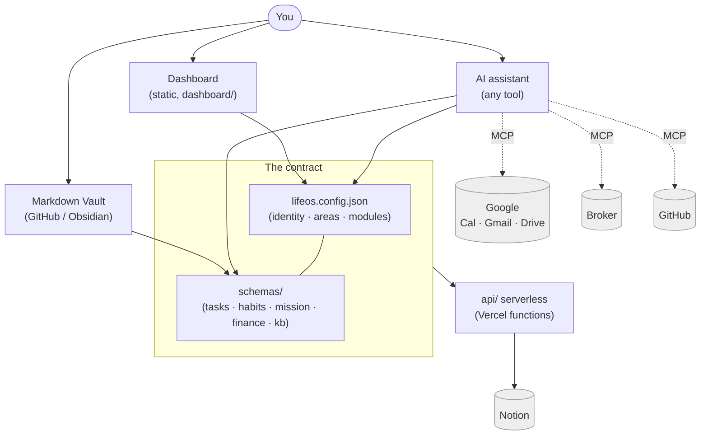

# LifeOS Architecture

**What this is:** a high-level view of how LifeOS fits together — the layers, the data flow, and the one contract that keeps them from drifting.

The guiding idea: **your life data is plain text and open JSON; everything else is a lens over it.** You own the vault; the dashboard, the skills, and the connectors are all replaceable views and pipes. No layer hardcodes a person — identity, areas, and enabled modules all come from `lifeos.config.json`, and the shapes of the data come from `schemas/`.

---

## The layers

**You** interact through three doors, all reading and writing the same underlying data:

1. **The Dashboard** (`dashboard/`) — a static, single-page HTML/JS app. No build step, no framework, `localStorage` for client state. It renders the current hero mission, tasks, habits, knowledge, finance, and the Anchor. Trivially self-hostable or archivable.
2. **The Markdown Vault** (GitHub / Obsidian) — long-form, evergreen, human-readable content: your notes, project specs, routines, reviews. Git-versioned, offline-first. The repo *is* an Obsidian vault (relative Markdown links, YAML frontmatter), so a graph view and Dataview queries come for free.
3. **An AI assistant** — the AI layer, and it can be any of them (Claude, ChatGPT, Cursor, Copilot, Gemini). It reads the vault and config, then writes structured data back. Onboarding and ingestion are **prompt-driven against `schemas/`**, not a bespoke parser — which is exactly why the assistant is interchangeable. Claude Code users get bundled skills (`/setup`, `/daily-brief`, `/weekly-review`) that script the common flows; everyone else drives the same schemas from `AGENTS.md`.

All three agree on one **contract**:

- **`dashboard/lifeos.config.json`** — who you are (name, timezone, currency, greeting), your **area codes**, which **modules** are on, and which **integrations** are enabled. It lives inside the deploy root (`dashboard/`) so a hosted dashboard reads it; copy it from `dashboard/lifeos.config.example.json`. Safe to commit (identity + toggles, never keys).
- **`schemas/`** — JSON Schemas for `tasks`, `habits`, `mission`, `finance`, and the `kb` (knowledge base). Every surface and every importer validates against these, so nothing drifts.

Below the contract sits the **optional** machinery:

- **`api/` serverless functions** — small Vercel functions (`notion-sync.js`, `notion-pull.js`) that push/pull the Tasks and Habits databases to **Notion**. Authenticated with a shared secret. Entirely optional — with no env vars, the dashboard degrades gracefully to local-only.
- **MCP connectors** — your assistant reads/writes external systems (Google Workspace, a broker, GitHub) through the Model Context Protocol. Any MCP-capable client works. In v1 these are docs-first and optional.

---

## Data-flow diagram

Solid edges are always-on paths within the repo. **Dashed edges are MCP connectors** — optional, docs-first, and off until you enable them in `lifeos.config.json` and `.mcp.json`.

---

## Data tiers (where each kind of thing lives)

**Tier 1 — Source of truth (Markdown in Git).**
Long-form, evergreen content that changes infrequently: notes, project specs, routines, weekly reviews, guides. Git-versioned, portable, offline-first, and directly readable/editable by any assistant. This tier never depends on any external service.

**Tier 2 — Structured data (JSON, schema-validated).**
The machine-readable state the dashboard renders: `dashboard/mission.json` (the hero), `dashboard/finance-data.json`, tasks, habits, and the knowledge base. Each conforms to a file in `schemas/`. This is what importers write to and what connectors sync.

**Tier 3 — Client state (dashboard `localStorage`).**
Real-time UI state: checkbox ticks, theme choice, the current week view, quote favorites. Namespaced by mission slug so ticks never bleed across mission swaps. Persisted per-device; degrades gracefully with no network.

**Tier 4 — Optional sync/back-end (serverless + Notion).**
When you turn on the Notion connector, `api/notion-sync.js` pushes local task/habit changes up and `api/notion-pull.js` hydrates them back down — so a phone edit in Notion and a desktop edit on the dashboard converge. Off by default.

---

## The mission model (why the hero is swappable)

The dashboard hero — header, countdown, one-thing, week planner, evidence — renders **entirely** from `dashboard/mission.json` (schema: `schemas/mission.schema.json`). Nothing else hardcodes the current focus. Swapping the hero is a ~10-minute edit: snapshot the old mission JSON, write the new one (new gate date, week rows, one-thing, evidence), update your home index. The checkbox keys are namespaced by the mission `slug`, so a swap never carries stale ticks forward.

For the demo persona that mission is **"Operation Launch Week"** — Alex Rivera shipping the app *Fieldnotes* to 50 beta users. Yours will be whatever you're driving toward this month.

---

## Sync architecture (staged)

LifeOS is designed so sync can grow without reworking the vault:

- **Manual / local (default).** You edit files; the dashboard reads them. No services, no secrets.
- **Two-way Notion sync (built, optional).** Dashboard task/habit cards push and pull to two Notion databases via `api/`, authenticated with `SYNC_SHARED_SECRET`. Notion is the mobile front-end; the repo stays source of truth. See [connectors/notion.md](connectors/notion.md).
- **Calendar / mail / broker (planned, MCP-only for now).** Today an MCP-capable assistant can read these live; dedicated serverless sync functions are on the roadmap, not shipped. See [ROADMAP.md](ROADMAP.md).

---

## Security & configuration model

- **Secrets never live in `lifeos.config.json` or the vault.** They live in `.env` (gitignored) locally and in your host's environment variables in production. Templates: `.env.example`, `.mcp.example.json`.
- **The dashboard → serverless calls are authenticated** with a shared secret (`SYNC_SHARED_SECRET`), checked via an `X-Sync-Secret` header. If unset, auth is open — fine for local dev, not for a public deployment.
- **The config file is safe to commit.** It carries identity and toggles, never keys.
- **Deployment can be private.** The dashboard is personal; you can gate it behind your host's deployment protection. See [deploy.md](deploy.md).

---

## Technology choices (and why)

| Layer | Choice | Why |
|---|---|---|
| Source of truth | Markdown + Git | Versioning, portability, no lock-in, AI-readable |
| Structured data | JSON + JSON Schema | One contract every surface validates against |
| Dashboard | Plain HTML5 + JS | Zero build, one file, fast, trivially archivable |
| Hosting | Static host (e.g. Vercel) | Git-native, free tier, serverless functions, CDN |
| Mobile mirror | Notion (optional) | Great mobile app, filtering, zero learning curve |
| AI layer | Any assistant (schemas + `AGENTS.md`) | Reads the vault, writes schema-valid data; not tied to one tool |
| External systems | MCP connectors | Managed, uniform integration surface |

---

## Where to go next

- Adopt it: [onboarding.md](onboarding.md)
- Ship the dashboard: [deploy.md](deploy.md)
- Wire an integration: [connectors/README.md](connectors/README.md)
- See the plan: [ROADMAP.md](ROADMAP.md)
